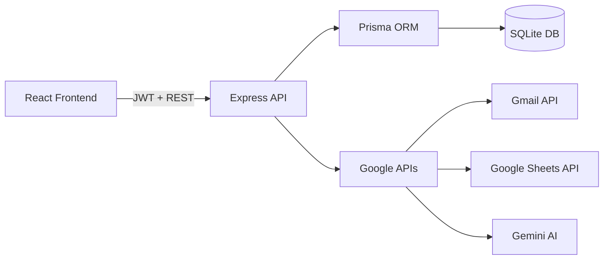
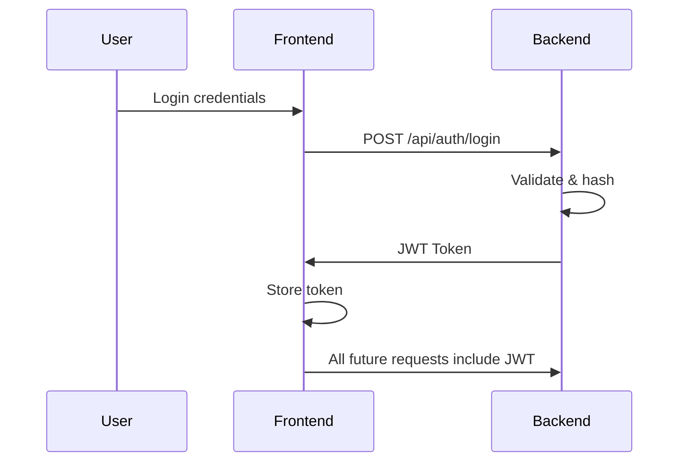
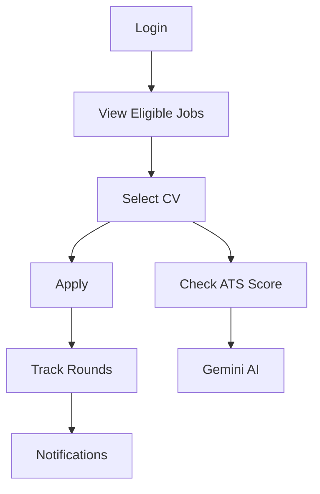
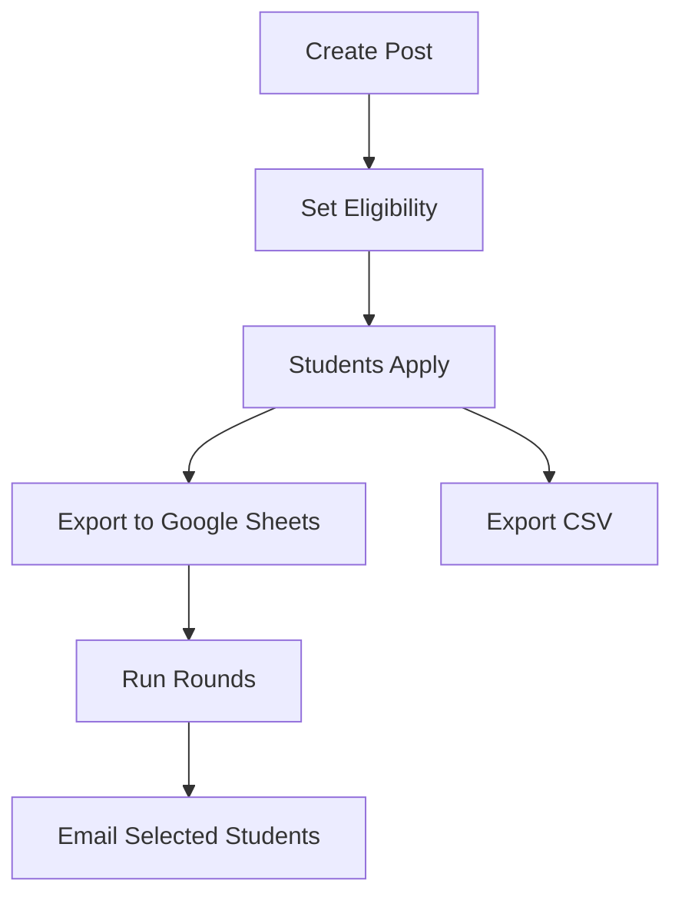
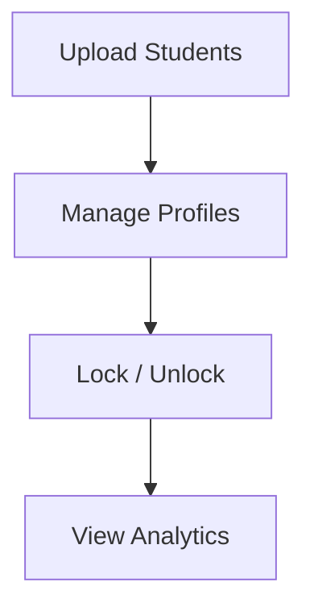

# 🚀 NITA Placement Management System

A full-stack placement automation platform for **NIT Agartala** that manages the complete on‑campus recruitment lifecycle — from eligibility filtering to multi‑round selections, analytics, and Google‑powered workflows.

Built as a **hackathon‑grade + production‑grade** system.

---

## 🧠 Why this exists
Placement cells struggle with:
- Manual eligibility filtering  
- CV collection chaos  
- Round‑wise tracking  
- Poor communication  
- Zero analytics  

This system replaces all of that with a **secure, role‑based, real‑time web platform**.

---

## 🎥 Project Demo

<p align="center">
  <a href="https://youtu.be/uCGexePamX4">
    
  </a>
</p>

Click the image above to watch the full project walkthrough.


## 🚀 Live Application

<p align="center">
  <a href="https://campus-opportunity-platform.vercel.app/" target="_blank">
    <strong>👉 Click here to try the live app</strong>
  </a>
</p>


## 🧩 High Level Architecture



---

## 👥 Roles

| Role | Capabilities |
|------|--------------|
| Student | Apply, manage CVs, track rounds, ATS scoring |
| Coordinator | Post drives, run rounds, email students, export Sheets |
| CCD Admin | Users, students, locks, analytics |
| CCD Member | Read‑only analytics |

---

## 🔐 Authentication Flow



---

## 🎓 Student Journey



---

## 🧑‍💼 Coordinator Workflow



---

## 🛡 CCD Admin Control



---

## 🌐 Google‑Powered Hackathon Features

These features were added as **prototype demos** to showcase how Google tools can transform placement workflows.

> ⚠️ These are proof‑of‑concept features — designed to show **vision & capability**, not mass deployment.

### 📧 1. Email Notifications (Gmail API)
Coordinators can send **automated emails** to:
- Students selected for next round  
- Students rejected  

Uses **Google Gmail API** for:
- Authenticated sending
- Real inbox delivery
- Hackathon‑grade integration

---

### 📊 2. Export to Google Sheets
Instead of downloading CSVs, coordinators can:

- Export applicant data directly to **Google Sheets**
- Share live sheets with companies
- Auto‑generate columns based on selected student fields

Uses:
- **Google Sheets API**
- OAuth‑based authenticated write access

This replaces Excel and enables **real‑time collaboration**.

---

### 🤖 3. Resume ATS Scoring (Gemini AI)

Students can paste their **Google Drive CV link** and:
- System downloads the resume
- Sends it to **Gemini AI**
- Gets an **ATS compatibility score**
- Shows feedback on how well the CV matches job descriptions

This demonstrates how **AI‑driven placement guidance** can be integrated.

Uses:
- **Google Gemini API**
- Resume parsing + semantic analysis

---

## 📊 Analytics Provided

- Total students  
- Dream / Standard / Normal placed  
- Branch‑wise placement %  
- Locked students  

---

<p align="center">
  <!-- Frontend -->
  
  
  
  

  <!-- Backend -->
  
  
  
  
  

  <!-- AI & Google -->
  
  
  
</p>


## 🏗 Local Setup

```bash
git clone <repo>
cd backend
npm install
cp .env.example .env
npx prisma migrate dev
npm run dev
```

```bash
cd frontend
npm install
npm run dev
```

---

## 🔐 Security

- bcrypt password hashing  
- JWT authentication  
- Role‑based route guards  
- Server‑side eligibility checks  
- Audit logging  

---

## 📌 Production‑Grade Features

✔ One‑student‑one‑application rule  
✔ Eligibility revalidation on edits  
✔ Multi‑round hiring  
✔ CSV + Google Sheets export  
✔ Bulk student upload  
✔ Email notifications  
✔ AI‑based resume analysis  

---

## 👤 Author

**Shivesh Deogharia**  

