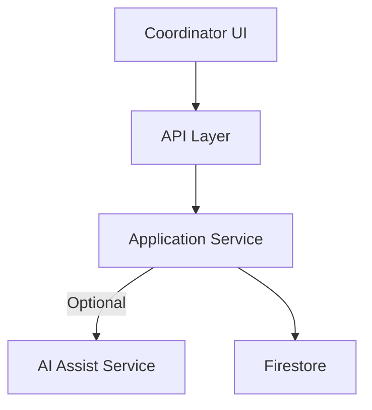
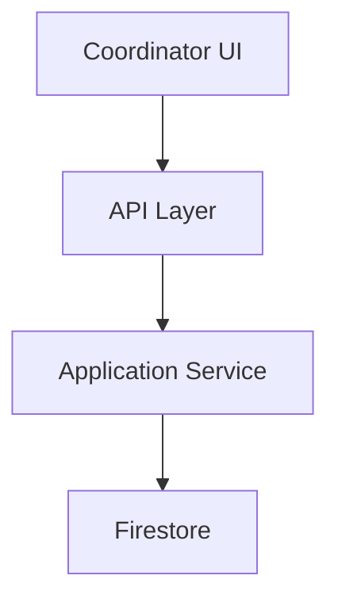
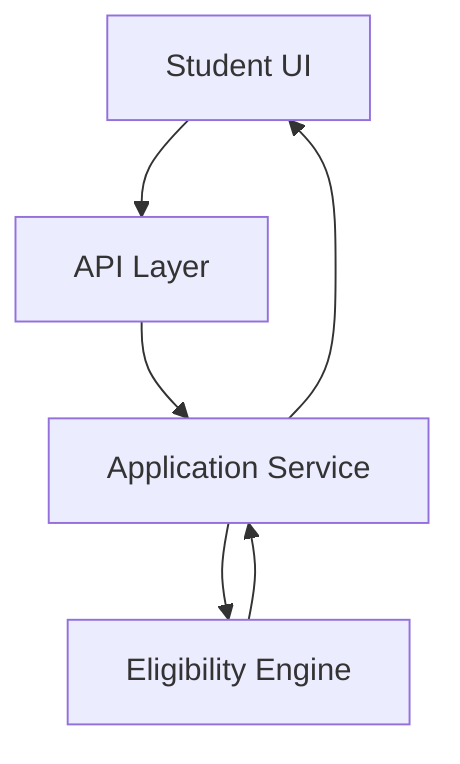
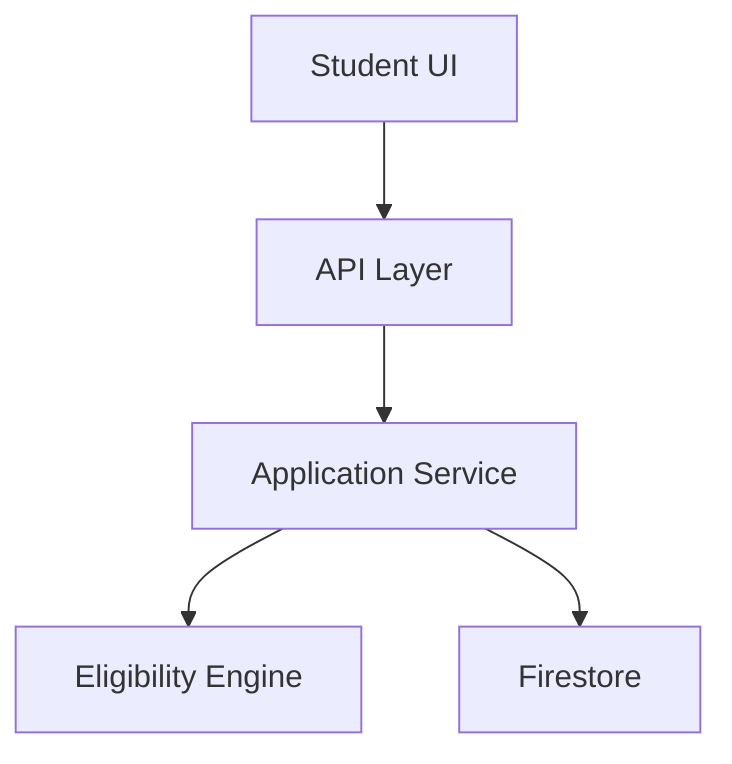
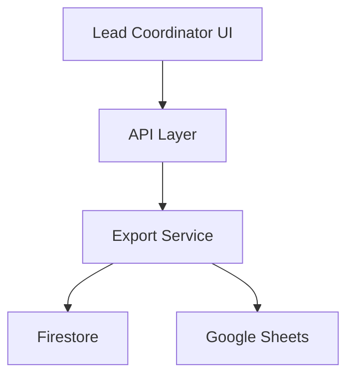

# Data Flow Diagrams

This document describes the runtime data flows across major system actions using Mermaid diagrams.

---

## Opportunity Creation Flow

---

## Opportunity Publish Flow

---

## Eligibility Check Flow

---

## Application Submission Flow

---

## Export Flow

