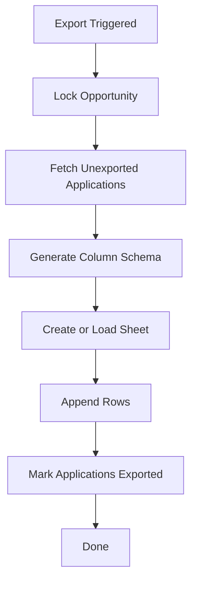

# Export Pipeline

This document describes how application data is exported safely to Google Sheets.

---

## Design Goals

- Google Sheets is the final institutional output
- Export must be idempotent
- No duplicate rows
- Recoverable from partial failures

---

## Export Steps

---

## Failure Recovery

- If export fails mid-way, retry only processes unexported applications
- Sheet ID is reused on retries
- Applications are marked exported only after successful append
