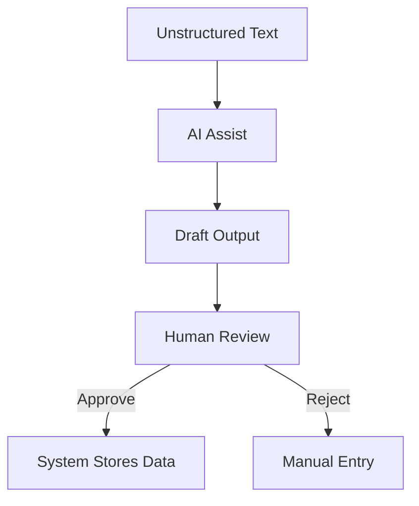

# AI Usage and Limits

This document defines the role of AI in the system.

---

## What AI Does

- Parses unstructured opportunity text
- Suggests eligibility drafts
- Flags ambiguity and missing data

---

## What AI Never Does

- Publish opportunities
- Modify eligibility rules post-publish
- Reject or shortlist students
- Trigger exports

---

## Human-in-the-Loop Guarantee

