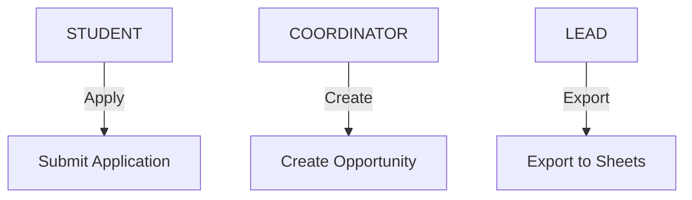

# Security and Roles

This document defines access control and role boundaries.

---

## Roles

- STUDENT
- COORDINATOR
- LEAD_COORDINATOR

Roles are additive.

---

## Permission Model

---

## Security Principles

- Backend enforces all permissions
- Frontend is treated as untrusted
- Sensitive actions require explicit role checks
