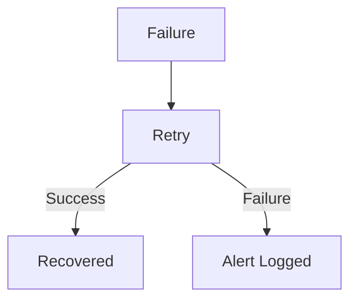

# Scalability and Failure Modes

This document outlines expected load and system behavior under failure.

---

## Scalability Assumptions

- Up to 500 applications per opportunity
- Short peak submission windows
- Read-heavy during application periods

---

## Failure Scenarios

---

## Failure Handling

- Firestore write failures are retried
- Export failures are idempotent
- No partial state corruption
